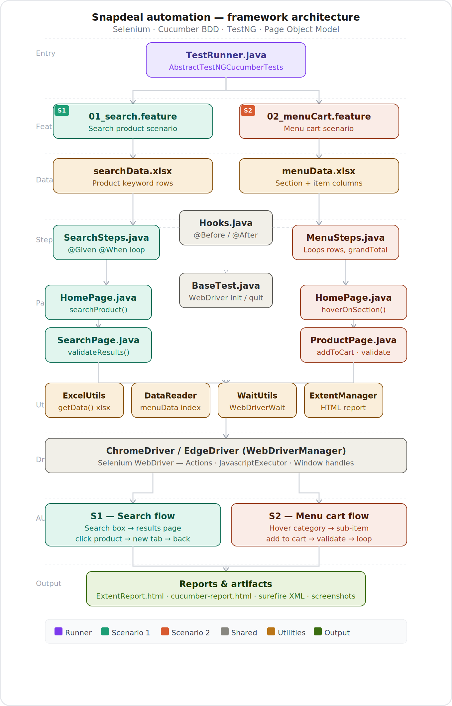

## Snapdeal Automation Framework

## Project Overview
This project implements a Hybrid Test Automation Framework using Java, Selenium, Cucumber (BDD), and Maven. It follows the Page Object Model (POM) design pattern and supports cross-browser execution, data-driven testing, reporting, and logging.

## Objective
- Automate real-time web scenarios.
- Implement BDD using Cucumber.
- Support cross-browser execution (Chrome and Edge).
- Enable data-driven testing.
- Generate execution reports and logs.
- Support Maven execution using `mvn clean test`.

  ## Key Features
- Hybrid Framework (POM + BDD + Data-Driven)
- Cross-browser support (Chrome and Edge)
- Logging using Log4j2
- Screenshot capture on failure
- Maven-based execution
- Reusable and maintainable architecture
- Externalized configuration using `config.properties`
- Implementation of OOP principles

## Tech Stack
- Java
- Selenium WebDriver
- Cucumber (BDD)
- Maven
- TestNG (if applicable)
- WebDriverManager
- Log4j2 (Logging)
- Extent/Cucumber Reports
- Git & GitHub

## Framework Architecture
The framework follows a **Hybrid approach** combining:
- **Page Object Model (POM)**
- **BDD with Cucumber**
- **Data-Driven Testing**
- **Reusable Utility Components**

## Architecture Diagram


## Project Structure 
Veeva-Project
│
├── src
│ ├── test
│ │ ├── java
│ │ │ ├── base
│ │ │ ├── pages
│ │ │ ├── stepdefinitions
│ │ │ └── runners
│ │ └── resources
│ │ ├── features
│ │ ├── config.properties
│ │ └── log4j2.xml
│
├── test-output/ # Execution reports
├── screenshots/ # Failure screenshots
├── pom.xml # Maven configuration
└── README.md # Project documentation

## Prerequisites
- Java JDK 8+
- Maven 3.6+
- Chrome and Edge browsers
- Git
- IDE (IntelliJ/Eclipse)

## Setup & Execution Instructions
```bash
git clone https://github.com/Rushitha-Valluri64/Veeva-Project.git
cd SNAPDEAL
mvn clean test
```
## Eclipse IDE Setup
# Import as Maven project
File -> Import -> Maven -> Existing Maven Projects

# Run tests from Eclipse
Right-click TestRunner.java -> Run As -> TestNG Test

## Cross-Browser Support
Browser selection is controlled via config.properties:
browser=chrome

## Reporting & Logging
Execution reports are generated in the test-output/ directory.
Screenshots are captured on failure.
Logging is implemented using Log4j2 (log4j2.xml).

## Test Scenarios
Search for a product on Snapdeal.
Add a product to the cart and validate totals.

## Feature Files
# 01_search.feature
Feature: Search functionality
Scenario: Search products from Excel
  Given User is on homepage
  When User searches for products from excel

# 02_menuCart.feature
Feature: Kids Fashion Cart Flow
Scenario: Add products from Excel
  Given User is on Snapdeal homepage
  When User performs menu operations from excel

## OOP Concepts Implemented
Encapsulation
Abstraction
Inheritance
Polymorphism
Interfaces

## Documentation
Detailed documentation is available in Snapdeal Automation Framework Project.pdf.

## Git Repository
https://github.com/Rushitha-Valluri64/Veeva-Project.git

## Author
Rishitha Valluri

## License
This project is developed for academic and evaluation purposes only.

## Contact
Maintainer: AutoTest Duo Team
Email: vallurigowthami60@gmail.com
GitHub: https://github.com/Rushitha-Valluri64/Veeva-Project.git
